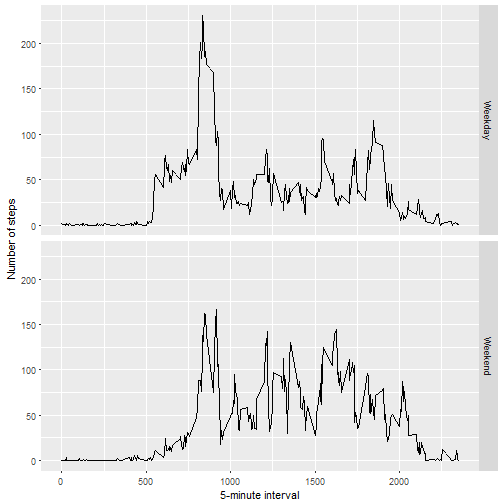

##Loading and preprocessing the data

The packages dplyr, ggplot2 and lubridate are loaded .The file is downloaded using download.file() and unzipped using unzip().Post that activity.csv is read using read.csv()


```r
library(dplyr)
```

```
## 
## Attaching package: 'dplyr'
```

```
## The following objects are masked from 'package:stats':
## 
##     filter, lag
```

```
## The following objects are masked from 'package:base':
## 
##     intersect, setdiff, setequal, union
```

```r
library(ggplot2)
library(lubridate)
```

```
## 
## Attaching package: 'lubridate'
```

```
## The following object is masked from 'package:base':
## 
##     date
```

```r
path <- getwd()
url <- "http://d396qusza40orc.cloudfront.net/repdata%2Fdata%2Factivity.zip"
download.file(url , file.path(path, "activity.zip"))
unzip(zipfile = "activity.zip")
activity <- read.csv("activity.csv")
```
##What is mean total number of steps taken per day?

The total number of steps taken per day are stored in totalStepsPerDay and it is calculated using dplyr verbs.


```r
totalStepsPerDay <- activity %>% group_by(date) %>%summarise(totalSteps=sum(steps,na.rm=TRUE),na=mean(is.na(steps)))
```
The total number of steps taken per day are 0, 126, 11352, 12116, 13294, 15420, 11015, 0, 12811, 9900, 10304, 17382, 12426, 15098, 10139, 15084, 13452, 10056, 11829, 10395, 8821, 13460, 8918, 8355, 2492, 6778, 10119, 11458, 5018, 9819, 15414, 0, 10600, 10571, 0, 10439, 8334, 12883, 3219, 0, 0, 12608, 10765, 7336, 0, 41, 5441, 14339, 15110, 8841, 4472, 12787, 20427, 21194, 14478, 11834, 11162, 13646, 10183, 7047, 0

Histogram of the total number of steps taken each day is plotted below


```r
totalStepsPerDay <- filter(totalStepsPerDay, na < 1)
hist(totalStepsPerDay$totalSteps,col="red",breaks=20,main="Total steps per day",xlab="Steps per day")
```


```r
meanSteps <- mean(totalStepsPerDay$totalSteps,na.rm=TRUE)
meanSteps
```

```
## [1] 10766.19
```

```r
medianSteps <- median(totalStepsPerDay$totalSteps,na.rm=TRUE)
medianSteps
```

```
## [1] 10765
```
The mean and median of the total number of steps taken per day are 1.0766189 &times; 10<sup>4</sup> and 10765 respectively.

##What is the average daily activity pattern?

A time series plot (i.e. type = "l") of the 5-minute interval (x-axis) and the average number of steps taken, averaged across all days (y-axis)


```r
averageSteps <- aggregate(x = list(steps = activity$steps), by = list(interval = activity$interval), 
    FUN = mean, na.rm = TRUE)
ggplot(data = averageSteps, aes(x = interval, y = steps)) + geom_line() + xlab("5-minute interval") + 
    ylab("average number of steps taken")
```


```r
maxNumberSteps <- filter(averageSteps ,steps==max(steps))
maxNumberSteps
```

```
##   interval    steps
## 1      835 206.1698
```
On average across all the days in the dataset 835, 206.1698113contains the maximum number of steps

##Imputing missing values

The total number of missing values in the dataset are below


```r
missingValues <- is.na(activity$steps)
table(missingValues)
```

```
## missingValues
## FALSE  TRUE 
## 15264  2304
```
The strategy for filling in all of the missing values in the dataset is replacing the NAs with the mean for that 5-minute interval.
Function replaceNA() replaces NA's with the mean for that 5-minute interval and the final result is stored in newData .


```r
replaceNA <- function(steps, interval) {
    replaceData <- NA
    if (!is.na(steps)) 
        replaceData <- c(steps) else replaceData <- (averageSteps[averageSteps$interval == interval, "steps"])
    return(replaceData)
}
newData <- activity
newData$steps <- mapply(replaceNA, newData$steps, newData$interval)
```
a histogram of the total number of steps taken each day

```r
totalSteps1 <- tapply(newData$steps, newData$date, FUN = sum)
qplot(totalSteps1, binwidth = 1000, xlab = "total number of steps taken each day")
```


```r
meanTotalSteps1 <- mean(totalSteps1)
meanTotalSteps1
```

```
## [1] 10766.19
```

```r
medianTotalSteps1 <- median(totalSteps1)
medianTotalSteps1
```

```
## [1] 10766.19
```
The mean and median total number of steps taken per day are 1.0766189 &times; 10<sup>4</sup> and 1.0766189 &times; 10<sup>4</sup> .
These values are higher than the estimates from the first part of the assignment . The reason being NAs were defaulted to 0's in first part and now it is replaced using mean value , hence mean and median values are higher.

##Are there differences in activity patterns between weekdays and weekends?

 A new factor variable  newData$day is created in the dataset newData with two levels – “weekday” and “weekend” indicating whether a given date is a weekday or weekend day.


```r
newData$day  <-  ifelse(wday(newData$date) %in% c(1,7), "Weekend", "Weekday")
```
A panel plot containing a time series plot (i.e. type = "l") of the 5-minute interval (x-axis) and the average number of steps taken, averaged across all weekday days or weekend days (y-axis). 


```r
averageStepsTaken <- aggregate(steps ~ interval + day, data = newData, mean)
ggplot(averageStepsTaken, aes(interval, steps)) + geom_line() + facet_grid(day ~ .) + 
    xlab("5-minute interval") + ylab("Number of steps")
```



